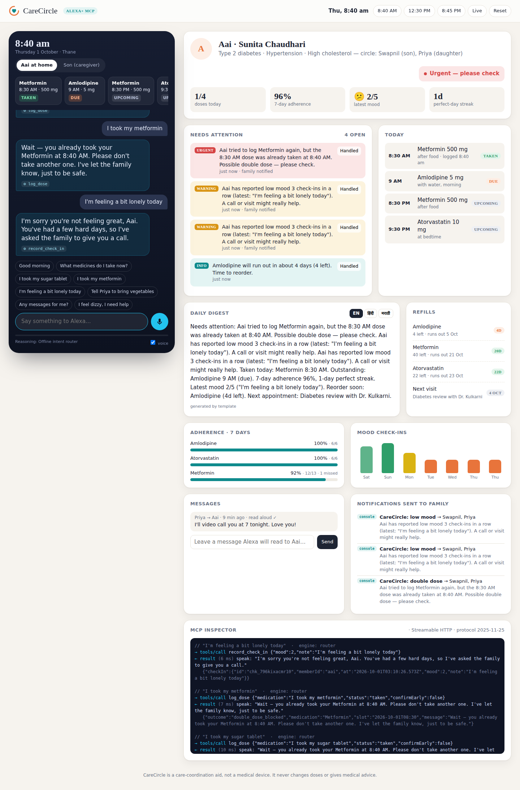

# CareCircle: keeps the family close and Aai's medicines on track

**An Alexa+ MCP server that helps older parents take their medicines safely and quietly keeps their children in the loop.**

> Track: **Alexa+** (self-hosted MCP server, spec `2025-11-25`, Streamable HTTP)
> Mini challenges: **AWS Builder** (Bedrock, DynamoDB, SNS, Lambda, EventBridge Scheduler) · **Open Source** (MIT)

---



## The problem

In India alone, about 150 million people are over 60. Many of them live on their own while their children work in other cities or abroad. Most take 3–5 medicines a day, and roughly half of patients with chronic conditions don't take their medicines as prescribed. The result is missed doses, accidental double doses and avoidable hospital visits. Meanwhile, the son in Bengaluru keeps calling and asking "Aai, did you take your tablet?" and still doesn't really know how she's doing.

Pill-reminder apps don't work for this person. They need a smartphone, small text and tapping through screens. **A voice in the kitchen does work.**

## What CareCircle does

Aai just talks to Alexa the way she talks to anyone:

| Aai says | CareCircle does |
|---|---|
| "Good morning" | Reads today's plan, delivers a voice message from her daughter, asks how she slept |
| "I took my sugar tablet" | Matches the spoken name to **Metformin 500 mg** and logs the 8:30 AM dose, then updates the pill count |
| "I took my metformin" (again) | 🛑 **Double-dose guard:** *"Wait, you already took it at 8:40. Please don't take another one."* The family gets an urgent alert |
| "I'm feeling a bit lonely" | Records a check-in. After the **third low-mood day in a row**, it asks her children to call |
| "Tell Priya to bring vegetables" | Sends the message to her daughter by SMS or email |
| "I feel dizzy, I need help" | Alerts everyone at once and suggests 112 if it sounds like an emergency |

Her son asks his own Alexa *"How is Aai doing today?"* and gets a short **AI-written digest in English, Hindi or Marathi**. Urgent items come first, then medicines, mood, refills and the next doctor visit.

### Proactive safety engine (the "circle")
This runs after every interaction and every 30 minutes through EventBridge Scheduler:
- **Missed dose:** not confirmed 3 hours after the scheduled time
- **Repeated misses:** 2 in a row of the same medicine → urgent
- **Silence signal:** no interaction at all by 11 AM
- **Low-mood trend:** 3 low check-ins in a row, or a sharp drop from her usual mood
- **High pain:** 7/10 or more
- **Refill forecast:** days of stock left per medicine, with alerts at 5 days and 2 days
- **Skipped dose**, including the reason she gave ("felt dizzy")

CareCircle **never gives medical advice or changes doses.** It coordinates care and leaves clinical decisions to doctors.

## Architecture

```
 ┌────────────┐  Streamable HTTP (JSON-RPC, 2025-11-25)   ┌──────────────────────────────┐
 │  Alexa+    │ ────────────────────────────────────────▶ │  CareCircle MCP server       │
 │  (or web   │  tools/list · tools/call · prompts ·      │  Node 22 / TypeScript        │
 │  simulator)│  resources   Bearer auth                  │  @modelcontextprotocol/sdk   │
 └────────────┘                                           │  AWS Lambda (Web Adapter)    │
                                                          └──────┬───────┬───────┬───────┘
                                                                 │       │       │
                                                      DynamoDB ◀─┘   Bedrock    SNS ──▶ SMS / email
                                                    (care data)  (digest +     to family
                                                                  agent)
                                         EventBridge Scheduler ──▶ /api/scan every 30 min
```

**MCP surface**
- **14 tools** with full annotations (`readOnlyHint`, `idempotentHint`, `openWorldHint`, …) and `structuredContent`. Every result carries a `speak` string written for an elderly listener.
  - Member: `get_todays_plan`, `log_dose`, `record_check_in`, `check_messages`, `send_family_message`, `request_help`
  - Caregiver: `get_family_digest`, `get_adherence_report`, `get_alerts`, `acknowledge_alert`, `manage_medication`, `refill_status`, `leave_message_for_member`, `add_appointment`
- **Resource:** `carecircle://care-plan`
- **Prompts:** `morning_routine`, `caregiver_briefing`
- **Server instructions** that teach the agent the safety rules (double-dose handling, early-dose confirmation, emergencies → `request_help`)
- **Stateless** Streamable HTTP (a fresh server and transport per request), so it scales horizontally on Lambda. It validates `Origin` and requires a Bearer token.

**Alexa+ web simulator.** Until an Alexa+ developer preview is available to everyone, `/` serves an Echo-Show-style simulator with voice in and out (Web Speech API, `en-IN`). It works as a **real MCP client**: it connects to `/mcp` over Streamable HTTP and lets **Amazon Bedrock (Converse + tool use)** choose and call the tools. If Bedrock isn't configured, a deterministic intent router takes over, so the demo also runs offline. The **MCP inspector** panel shows every `tools/call` live. A demo clock lets you jump to 8:40 AM, 12:30 PM or 8:45 PM to see the time-based logic.

## Run it locally (2 minutes)

```bash
npm install
npm run dev            # http://localhost:8080  (simulator + dashboard)
                       # http://localhost:8080/mcp  (MCP endpoint)
npm test               # 12 unit tests: matching, double-dose guard, safety scan, adherence…
```

Optional environment variables:

| Var | Purpose |
|---|---|
| `BEDROCK_MODEL_ID` | e.g. `us.amazon.nova-pro-v1:0`. Turns on the Bedrock agent and the AI digest (needs AWS credentials) |
| `CARECIRCLE_TABLE` | DynamoDB table (`pk`/`sk` strings). If unset, an in-memory store is used |
| `SNS_TOPIC_ARN` | Family alert fan-out over SMS or email |
| `MCP_AUTH_TOKEN` | Require `Authorization: Bearer …` on `/mcp` |
| `ALLOWED_ORIGINS` | Comma-separated Origin allowlist |

### Try it with MCP Inspector
```bash
npx @modelcontextprotocol/inspector
# Transport: Streamable HTTP · URL: http://localhost:8080/mcp
```

## Deploy to AWS

```bash
sam build
sam deploy --guided \
  --parameter-overrides McpAuthToken=$(openssl rand -hex 24) CaregiverEmail=you@example.com
```
The outputs include `McpEndpoint` (register it with Alexa+) and `SimulatorUrl`. The stack creates the Lambda function (container image + Function URL), a DynamoDB table (encrypted, with point-in-time recovery), an SNS topic, Bedrock permissions and a 30-minute safety-scan schedule.

## Project layout
```
src/
  mcp.ts      MCP server: tools, resource, prompts, instructions
  care.ts     Domain logic: schedule, dose guard, safety scan, adherence, refills
  agent.ts    Alexa+ simulator agent: MCP client + Bedrock tool-use loop / offline router
  ai.ts       Bedrock Converse wrapper + multilingual digest
  store.ts    DynamoDB / in-memory single-table store
  notify.ts   SNS family notifications
  seed.ts     Demo household ("Aai", 72, Thane)
  app.ts      Express: /mcp + dashboard API + static UI
public/index.html   Alexa+ simulator + family dashboard
template.yaml       AWS SAM stack · Dockerfile
docs/               Devpost submission text, product feedback, friction log, demo script
```

## Privacy & safety
- Health data stays in **your** AWS account: DynamoDB encrypted at rest, no third-party analytics.
- Only first names and relations are sent to the model. The digest prompt forbids medical advice.
- Emergency phrases always reach a human (family) and point to 112. CareCircle doesn't replace emergency services.

## License
MIT. See [LICENSE](LICENSE).
